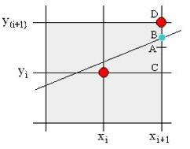
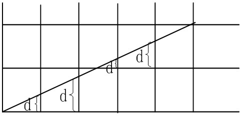

# 直线的绘制算法

**直线的绘制算法**

* 直线的扫描转换
* DDA 算法
* Bresenham 算法
* 中点坐标算法

## 1. 直线的扫描转换

**数学直线**：在数学上，理想的直线是一条没有宽度，由无穷多个无限小的连续的点组成。

**光栅平面显示的图像**：在光栅显示平面上，我们只能用二维光栅网格上尽可能靠近这条直线的象素集合来表示它。每个象素具有一定的尺寸，是显示平面上可被访问的最小单位，它的坐标x和y只能是整数，也就是说相邻象素的坐标值是阶跃的而不是连续的。


直线的扫描转换算法就是利用直线的数学性质，通过直线方程，算出直线在栅格上每个点的坐标。

**缺点**：算法中涉及大量的浮点运算，效率不高；没有利用栅格显示的特性。

## 2. DDA 算法

DDA（digital differential analyzer ） 算法，采用了增量的方式，提高直线扫描转换的效率。在计算 Y<sub>x+1</sub> 时，只需要用到 Y<sub>x</sub> 的值。

### 2.1 基本思想

假设直线段的宽度为1,直线段的斜率: |k|<=1

已知过端点的直线段L：y=kx+B

直线斜率为：

> $$k=(y_1-y_0)/ (x_1-x_0)$$

计算：

> $$
Y_{i+1} = kX_{i+1} + B
        = k(X_i+D_x)+B
        = kX_i + kD_x +B
        = Y_i + kD_x
$$
在栅格上，X 的增量 D<sub>x</sub> 的值都是1，所以

> $$ Y_{i+1} = Y_i + k $$

即：当x每递增1，y递增k，(即直线斜率)；取象素点(x, round(y))作为当前点的坐标。


### 2.2 算法实现

```
DDALine(int x0, int y0, int x1, int y1, int color)
{
    int x
    float dx,dy,k,y
    dx=x1-x0; dy=y1-y0;
    k=dy/dx;
    y=y0;
    for(x=x0;x<=x1;x++)
    {
        drawpixel(x,int(y+0.5),color);
        y=y+k;
    }
}
```

注：这里的 DDA 算法只实现了 |k|<=1 的情况，而 |k|>1 的直线只需要利用对称变换得到。

DDA 算法简单，实现容易，但y与k必须用浮点数表示，而且每一步都要对y进行四舍五入后取整，这使得它不利于硬件实现。

## 3. Bresenham 算法

### 3.1 基本思想

过各行各列象素中心构造一组虚拟网格线。按直线从起点到终点的顺序计算直线与各垂直网格线的交点，然后根据误差项的符号确定该列象素中与此交点最近的象素。该算法的巧妙之处在于采用增量计算，使得对于每一列，只要检查一个误差项的符号，就可以确定该列的所求象素。

先考虑斜率k=dy/dx≤1的直线。设直线方程为：

> $$ y_{i+1}=y_i+k(x_{x+1}-x_i)=y_i+k, k=dy/dx $$

假设当前像素的 x 坐标已经确定为 x<sub>i</sub> ，其 y 坐标为 y<sub>i</sub>，由于坐标 (x<sub>i</sub>,y<sub>i</sub>) (i=0,1,2,....) 只能取整数，那么下一个像素的 x 坐标为：

> $$ x_{i+1} = x_i + 1 $$

而 y<sub>i+1</sub> 的坐标有两种可能：
1. 保持不变，即 y<sub>i+1</sub> = y<sub>i</sub>
2. y 坐标递增1，即 y<sub>i+1</sub> = y<sub>i</sub> + 1

设 A 为 CD 边的中点，正确的选择：若 B 点在 A 点上方，选择 D 点；否则，选 C 点。



因为直线的起始点在象素中心，所以误差项d的初值d0＝0。X下标每增加1，d的值相应递增直线的斜率值k，即d＝d＋k。一旦d≥1，就把它减去1，这样保证d在0、1之间。

* 当 d≥0.5 时，最接近于当前象素的右上方象素 (x<sub>i</sub>+1, y<sub>i</sub>+1)
* 而当 d<0.5 时，更接近于右下方象素 (x<sub>i</sub>+1, y<sub>i</sub>)

为了方便计算，令 e=d-0.5，e的初值为-0.5，增量为k。
* 当 e≥0 时，取右上方象素 (x<sub>i</sub>+1, y<sub>i</sub>+1)
* 而当d<0.5时，取右方象素 (x<sub>i</sub>+1, y<sub>i</sub>)



### 3.2 算法实现

```
void Bresenhamline (int x0,int y0,int x1, int y1,int color)
{   
    int x, y, dx, dy;
    float k, e;
    dx = x1-x0, dy = y1- y0, k=dy/dx; 
    e=-0.5, x=x0, y=y0;		
    for (i=0; i<=dx; i++)	
    {    	
        drawpixel (x, y, color);		
        x=x+1，e=e+k;
        if (e>=0)
        { y++, e=e-1;}
    }
}	
```

注：这里的 Bresenham 算法只实现了 0< k <=1 的情况，而其他斜率的直线只需要利用对称变换得到。

## 4. 中点坐标算法

### 4.1 算法基本思想

