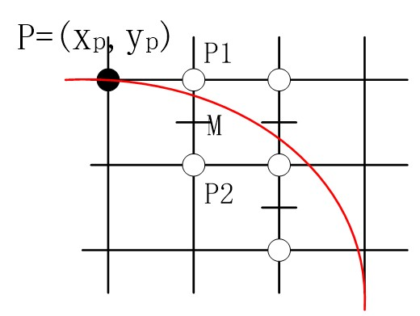
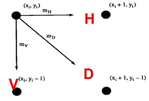
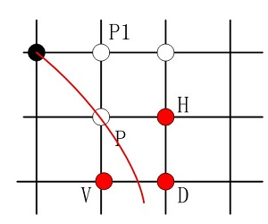
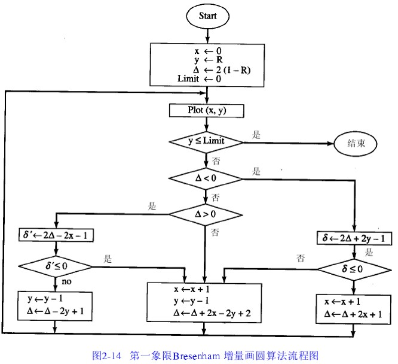
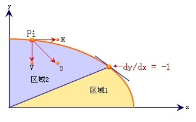
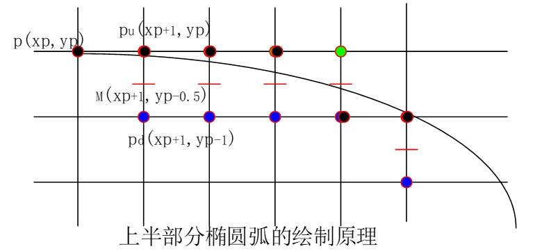
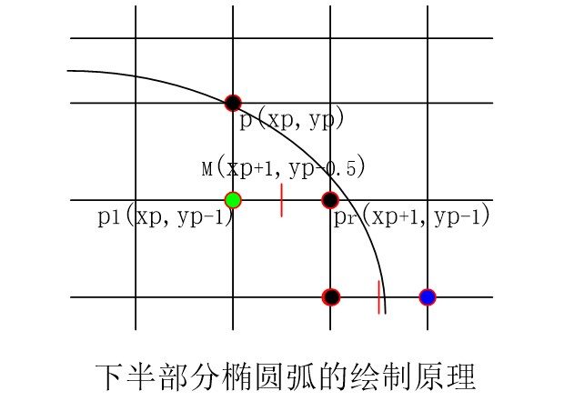

# 圆和椭圆的绘制算法

**圆的绘制算法**

* 圆的扫描转换
* 中点画圆算法
* Bresenham 算法

**椭圆的绘制算法**

* 中点坐标算法

## 1. 圆的扫描转换

与直线的扫描转换一样，通过圆的方程绘制圆，这样因为涉及到开方等运算，效率很低，不便于硬件实现，所以需要设计更加高效的算法。

## 2. 中点画圆算法

### 2.1 八对成称画圆

在介绍画圆算法前，介绍一下八对称画圆，这不是什么高深的算法，只是利用了圆的对称性，在实际画圆时只需要计算 1/8 圆就可以了。

```
void CirclePoints(int x, int y, Color color)
{
    drawPixel(x,y,color);
    drawPixel(x,-y,color);
    drawPixel(-x,y,color);
    drawPixel(-x,-y,color);
    drawPixel(y,x,color);
    drawPixel(-y,x,color);
    drawPixel(y,-x,color);
    drawPixel(-y,-x,color);
}
```

### 2.2 算法思想

与直线的中点算法一样，圆的中点算法也是一个增量算法。

我们假设圆的圆心在原点，半径为 R ，我们绘制的第一个像素时圆的最顶部的那个点 (0,R)。我们绘制下一个点的依据是栅格的中点 M 是在圆内还是在圆外，即我们现在要画 (x<sub>p+1</sub>, y<sub>p+1</sub>) 这个点，那么就判断点 (x<sub>p</sub> + 1, y<sub>p</sub> - 0.5) 是在圆内还是在圆外。

* 如果在圆内就绘制( x<sub>p</sub> + 1, y<sub>p</sub> )
* 如果在圆外就绘制( x<sub>p</sub> + 1, y<sub>p</sub> + 1 )



我们构造判别式：

> $$ f_{cir}(x,y) = x^2 + y^2 - r^2 $$

将点 M (x<sub>p</sub> + 1, y<sub>p</sub> - 0.5) 带入判别式，得到：

> $$ d = f_{cir}(x_p+1,y_p-0.5) = (x_p+1)^2 + (y_p-0.5)^2 - R^2 $$

* 当d<0时，M在圆内，这说明点P1距离圆更近， 应取点P1作为下一象素点；
* 当d>0时，M在圆外，表明P2点离圆更近，应取P2点；
* 当d=0时，在P1点与P2点之中随便取一个即可，我们约定取P2点。 

若 d<0,  则取P1为下一象素，而且再下一象素的判别式为：

> $$ d'= f_{cir}(x_p+2, y_p-0.5) = (x_p+2)^2 + (y_p-0.5)^2 - R^2 = d + 2x_p + 3 $$

若d>=0, 则应取P2为下一象素，而且下一象素的判别式为：

> $$ d'= f_{cir}(x_p+2, y_p-1.5) = (x_p+2)^2 + (y_p-1.5)^2 - R^2 = d + 2(x_p-y_p) + 5 $$

由于第一个像素是 (0,R) ， 判别式 d 的初始值：

> $$ d_0 = f_{cir}(1, R-0.5) = 1.25 - R$$

### 2.3 算法实现

```
MidPointCircle(int r int color)
{	
    int x,y;
    float d;
    x=0; y=r; d=1.25-r;
    circlepoints (x,y,color); //显示圆弧上的八个对称点
    while(x<=y)
    {	
        if(d<0)   
            d+=2*x+3;
        else    
        { 
            d+=2*(x-y)+5;  
            y--;
        }
        x++;
        circlepoints (x,y,color);
    }
}

```

注：为了进一步提高算法的效率，可以将上面的算法中的浮点数改写成整数，将乘法运算改成加法运算，即仅用整数实现中点画圆法。初始化运算使用 e=d-0.25 代替 d ，对应于 e=1-R。

## 3. Bresenham 算法

### 3.1 基本思想

以点 (0,R) 为起点按顺时针方向生成圆，则在第一象限 y 是 x 的单调递减函数。假设圆心和起点均精确地落在像素中心上。如果已经知道圆弧上的一点 (x<sub>i</sub>, y<sub>i</sub>)，下一个像素的选取有三种可能：

1. 正右方像素H
2. 右下角像素D
3. 正下方像素V




构造函数：

> $$ f(x,y) = x^2 + y^2 - R^2 $$

这三个像素的偏差的平方为：

> $$ \Delta_H = (x+1)^2 + y^2 - R^2 $$
> $$ \Delta_D = (x+1)^2 + (y-1)^2 - R^2 $$
> $$ \Delta_V = x^2 + (y-1)^2 - R^2 $$

令

> $$ \sigma_{HD} = |\Delta_H| - |\Delta_D| = 2(\Delta_D+y_i) - 1$$
> $$ \sigma_{DV} = |\Delta_D| - |\Delta_V| = 2(\Delta_D-x_i) - 1 $$

* 当 Delta_D < 0 时，如果 HD < 0 ，则取 H 下一个像素点，否则取V为下一个像素点。
* 当 Delta_D > 0 时，如果 DV < 0 ，则取 D 下一个像素点，否则取V为下一个像素点。
* 当 Delta_D = 0 时，则取 D 下一个像素点。

**推导递推公式：**

1. 如果取正右方像素（H）为下一个像素点，则第(i+1)个像素的坐标和有关的偏差的递推公式为：

> $$ x_{i+1} = x_i + 1 $$
> $$ y_{i+1} = y_i $$
> $$ \Delta D_{i+1} = \Delta D_{i} + 2x_{i+1} + 1 $$

2. 如果取右下角的像素（D）为下一个像素点，则第(i+1)个像素的坐标和有关的偏差的递推公式为：

> $$ x_{i+1} = x_i + 1 $$
> $$ y_{i+1} = y_i - 1 $$
> $$ \Delta D_{i+1} = \Delta D_{i} + 2x_{i+1} - 2y_{i+1} + 2 $$

3. 如果取正下方的像素（V）为下一个像素点，则第(i+1)个像素的坐标和有关的偏差的递推公式为：

> $$ x_{i+1} = x_i $$
> $$ y_{i+1} = y_i - 1 $$
> $$ \Delta D_{i+1} = \Delta D_{i} + 2y_{i+1} + 1 $$

**流程框图：**



### 3.2 算法实现

```
Bresenham_Circle(int r, Color color)
{
    int x,y,delta,delta 1,delta 2,direction;
    x=0; y=r;
    delta = 2*(1-r);  //△d的初始值
    Limit =0;
    while (y>=Limit)
    {  
        drwpixel(x,y,color)
        if (delta <0)
        {
            delta 1= 2*(delta +y)-1;  // 取H点
            if (delta 1 <=0 )direction =1; 
            else direction=2; //取D点
        }
        else if (delta>0)
        {
               delta 2 = 2*(delta –x)-1;  // 取D点
               if(delta 2 <0) direction =2;
               else direction =3; //取V点
        }
        else
          direction =2;
        Switch (direction)
        {
            case 1:   
                x++;
                delta +=2*x+1;
                break;
            case 2:   
                x++;
                y--;
                delta +=2*(x-y+1);
                break;
            case 3:   
                y--;
                delta +=(-2*y+1);
                break;
        }
    }
}
```

## 4. 椭圆的中点画法

### 4.1 基本思想

> $$ f(x,y) = b^2x^2 + a^2y^2 - a^2b^2 = 0 $$

椭圆的对称性，只考虑第一象限椭圆弧生成，分上下两部分，以切线斜率为-1的点作为分界点。



* 在上部分（区域2），法向量的y向分量较大，斜率K满足|k|<1, |△x|＞|△y|，所以x方向为主位移方向
* 在下部分（区域1），法向量的x分量较大，斜率K满足|k|>1, |△y|＞|△x|，所以y方向为主位移方向。

与圆弧中点算法类似：确定一个像素后，接着在两个候选像素的中点计算一个判别式的值，由判别式的符号确定更近的点。

**先讨论椭圆弧的上半部分**，(Xp, Yp) 中点 (Xp+1, Yp-0.5)

> $$ d_1 = F(X_p+1, Y_p-0.5) = b^2(X_p+1)^2 + a^2(Y_p-0.5)^2 - a^2b^2 $$

根据 d1 的符号来决定下一个像素是取正右方的那个，还是右上方的那个

* 若 d1<0 ，中点在椭圆内，取正右方象素，判别式更新为：

> $$ d1'=F(X_p+2,Y_p-0.5)=d1+b^2(2X_p+3) $$

d1的增量为

> $$ b^2(2X_p+3) $$

* 当d1≥0，中点在椭圆外，取右下方象素，更新判别式：

> $$ d1'=F(X_p+2,Y_p-1.5)=d1+b^2(2X_p+3)+a^2(-2Y_p+2) $$

d1的增量为

> $$ b^2(2X_p+3)+a^2(-2Y_p+2) $$

判别式的初始值：

> $$ d_0=F(1,b-0.5)=b^2+a^2(b-0.5)^2-a^2b^2=b^2+a^2(-b+0.25) $$



**从椭圆弧的上半部分转入转入下半部分判断条件**：

* 上半部分椭圆弧一点P(xi,yi)，中点M(xi+1,yi-0.5)，满足x方向分量小于y方向分量：

> $$ b^2(x_i+1)<a^2(y_i-0.5) $$

* 而在下一个中点，不等号改变方向，说明椭圆弧从上半部分转入到下半部分

> $$ b^2(x_i+1)>a^2(y_i-0.5) $$ 

**再来推导椭圆弧下半部分的绘制公式**：

> $$d_2 = F(x_p+0.5, y_p-1) = b^2(x_p + 0.5)^2 + a^2(y_p-1)^2 - a^2b^2$$

* 若 d<sub>2</sub> > 0，取 P1(X<sub>p</sub>,Y<sub>p</sub>-1)，递推公式：

> $$ d_2'=F(x_p + 0.5, y_p - 2) = b^2(x_p+0.5)^2 + a^2(y_p-2)^2 - a^2b^3 = d_2 + a^2(-2y_p+3) $$

* 若 d<sub>2</sub> <= 0，取 P1(X<sub>p</sub> + 1,Y<sub>p</sub>-1)，递推公式：

> $$ d_2'=F(x_p + 1.5, y_p - 2) = b^2(x_p+1.5)^2 + a^2(y_p-2)^2 - a^2b^3 = d_2 + b^2(2x_p+2) + a^2(-2y_p+3) $$

用上半部分计算的最后点 (x,y) 来计算下半部分中 d 的初始值：

> $$ d=b^2(x+0.5)^2 + a^2(y-1)^2 - a^2b^2 $$



## 4.2 算法实现

```
void MiddlePointOval(x0,y0,a,b,color){
    var x=a;
    var y=0;

    var taa = a*a;
    var t2aa = 2 * taa;
    var t4aa = 2 * t2aa;

    var tbb = b*b;
    var t2bb = 2*tbb;
    var t4bb = 2*t2bb;

    var t2abb = a * t2bb;
    var t2bbx = t2bb * x;
    var tx = x;

    var d1 = t2bbx * (x-1) + tbb / 2 + t2aa * (1-tbb);
    while(t2bb * tx > t2aa * y){    
        CirclePoint4(x,y,x0,y0,color);
        if(d1<0){
            y += 1;
            d1 = d1 + t4aa * y + t2aa;
            tx = x-1;
        }
        else{
            x -= 1;
            y += 1;
            d1 = d1 - t4bb * x + t4aa * y + t2aa;
            tx = x;
        }
        
    }
    
    var d2 = t2bb * (x*x + 1) - t4bb * x + t2aa * (y * y + y - tbb) + taa / 2;
    while(x>=0){
        CirclePoint4(x,y,x0,y0,color);
        if(d2<0){
            x-=1;
            y+=1;
            d2 = d2 + t4aa * y - t4bb * x + t2bb;
        }
        else{
            x-=1;
            d2 = d2 - t4bb * x + t2bb;
        }
    }
    
}

```