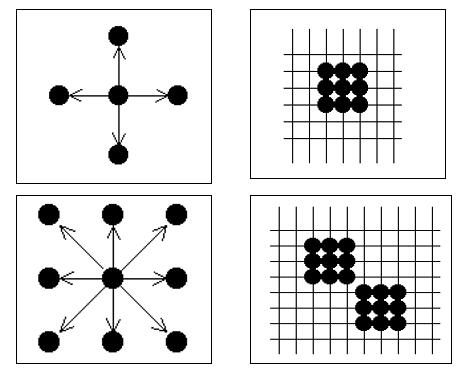

# 多边形的扫描转换

* 多边形有两种重要的表示方法：顶点表示和点阵表示。
* 顶点表示是用多边形的顶点序列来表示多变形。这种表示直观、几何意义强、占内存少，易于进行几何变换，被广泛用于几何造型系统中。
* 点阵表示是用于多边形内的像素几何来刻画多边形。这种表示丢失了许多几何信息（如边界、顶点），但它是光栅显示图形所需要的表示形式。
* 多边形的扫描转换：把多边形的顶点表示转换为点阵表示。

**使用的算法有：**
* 多边形的扫描转换
  
    * 扫描线算法
    * 边缘填充算法
    * 边界标志法

* 区域填充算法

## 1. 多边形的扫描转换算法

### 1.1 扫描线算法

目标：利用相邻像素之间的连贯性，提高算法效率。
处理对象：非自交多边形（边与边之间除了顶点外无其他交点）。

基本思想：按扫描线顺序，计算扫描线与多边形的相交区间，再用要求的颜色显示这些区间的像素，即完成填充工作。

四个步骤：

1. 求交：计算扫描线与多边形各边的交点
2. 排序：把所有交点按x值递增顺序排序
3. 配对：第一个与第二个，第三个与第四个等待；每对交点代表扫描线与多边形的一个相交区间
4. 着色：把相交区间内的像素置成多边形颜色，把相交区间外的像素置成背景色

**存在问题1**：当扫描线与多边形顶点相交时，交点的取舍问题。

_解决方法：_

当扫描线与多边形的顶点相交时
* 若共享顶点的两条边分别落在扫描线的两侧，交点只算**一个**
* 若共享顶点的两条边在扫描线的同一侧，这时交点作为**零个或两个**
* 具体实现时，只需检查顶点的两条边的另外两个端点的y值。按这两个y值中大于交点y值的个数是0，1，2来决定。

**存在问题2**：边界上像素的取舍问题，避免填充扩大化。

__解决方法__：边界像素：规定落在右上方边界的像素不予填充。具体实现时，只要对扫描线与多边形的相交区间**左闭右开**。

### **边相关扫描线填充算法**

扫描线的相关性质：某条扫描线上相邻的像素，几乎都具有同样的内外性质，这种性质只有遇到多边形边线与该扫描线的交点时才会发生改变。

边的相关性：由于相邻扫描线上的交点是与多边形的边线相关的。对同一条边，前一条扫描线yi与该边的交点为xi，而后一条扫描线yi+1 = yi + 1，与该边的交点则为xi+1 = xi + 1/m，利用这种相关性可以省去大量的求交运算。

边相关扫描线算法的实现需要建立两个表：**新编表（NET）**和**活动边表（AET）**。

新编表的构造：
1. 首先构造一个纵向扫描线链表，链表的长度为多边形所占有的最大扫描线数，链表的每个结点称为一个桶，对应多边形覆盖的每一条扫描线。
2. 将每条边的信息链入与该边最小y坐标（ymin）相对应的桶处。也就是说，若某边的较低端点为ymin，则该边就在相应的扫描线桶中。
3. 每条边的数据形成一个结点，内容包括：该扫描线与该边的初始交点x（即较低端点的x值），1/k，以及该边的最大y值ymax。
4. 同一个桶中若干条边按ymax由小到大排序，若ymax相等，则按照1/k由小到大排序。

活动边表的构造：

NET表建立以后，就可以开始扫描转换了。对不同的扫描线，与之相交的边线也是不同的，当对某一条扫描线进行扫描转换时，我们只需要考虑与它相交的那些边线，为此需要建立一个只与当前扫描线相交的边记录链表，称之为活动边表。

合并NET和AET：

**算法过程**：

1. 根据给出的多变形顶点坐标，建立NET表，求出顶点坐标中最大y值ymax和最小y值ymin。
2. 初始化AET表指针，使它为空。
3. 执行下列步骤直至NET和AET都为空：

> 3.1 如果NET中的第y类非空，则将其中的所有边取出并插入AET中； 
> 3.2 如果有新边插入AET，则对AET中各边排序； 
> 3.3 对AET中的边两两配对，（1和2为一对，3和4为一对，……），将每对边中x坐标按规则取整，获得有效的填充区段，在填充； 
> 3.4 将当前扫描线纵坐标y值递增1； 
> 3.5 如果AET表中某记录的ymax=yi，则删除该记录（因为每条边被看作下闭上开的）； 
> 3.6 对AET中剩下的每一条边的x递增1/k，即x+=1/k  

### 1.2 边缘填充算法

### 1.3 边界标志算法

## 2. 区域填充算法

区域：指已经表示成点阵形式的填充图形，它是象素的集合。

表示方法：内点表示、边界表示

内点表示

* 枚举处区域内部的所有像素
* 内部的所有像素着同一个颜色
* 边界像素着与内部像素不同的颜色

边界表示

* 枚举出边界上所有的像素
* 边界上的所有像素着同一颜色
* 内部像素着与边界像素不同的颜色

区域填充 —— 对区域重新着色的过程

* 将指定的颜色从种子点扩展到整个区域的过程
* 区域填充算法要求区域是连通的

连通性：4连通、8连通

